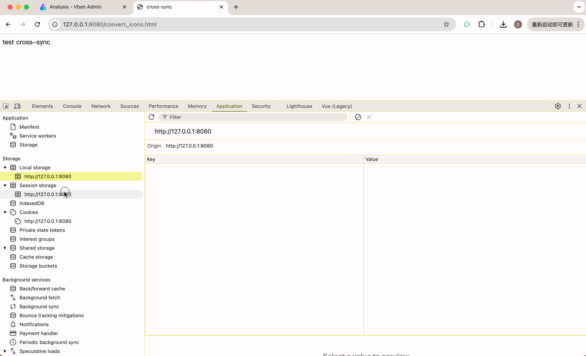

# Chrome Extension - Sync Storage

[English](README.md) | [中文](README_zh.md)

This Chrome extension helps developers automatically synchronize data (Cookies, LocalStorage, SessionStorage) from specified domains to the current domain.

1. Configure the source domain (the domain where the data originates)
2. Select the types of data to synchronize, supporting the following three:
   - Cookies
   - LocalStorage 
   - SessionStorage
3. One-click data synchronization
4. Real-time display of synchronization status and results

## Installation

### Source Code

1. Download the code
2. Open Chrome DevTools and click the extension icon in the toolbar
3. Click the "Load unpacked" button
4. Select the folder (`src`) where the code is located

### CRX File

1. [Download the CRX file](https://github.com/todrfu/sync-storage/actions/runs/13216106879)
2. Open Chrome DevTools and click the extension icon in the toolbar
3. Click the "Load unpacked" button
4. Select the CRX file

